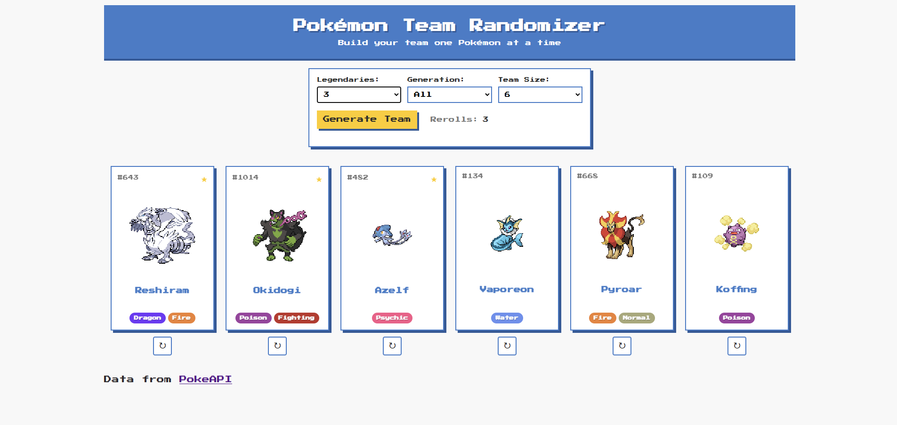

# Pokémon Team Randomizer



A web application that generates random Pokémon teams based on user preferences, with options to filter by generation and legendary count.

## Features

- **Random Team Generation**: Create teams of 1-6 random Pokémon
- **Customizable Filters**:
  - Select specific generations (Gen 1-9 or all)
  - Choose how many legendary Pokémon to include (0-6)
- **Interactive Pokémon Cards**:
  - Hover to see a Pokémon's first evolution (if applicable)
  - Click to open Bulbapedia page for more information
- **Individual Rerolls**: Reroll specific Pokémon while keeping the rest of the team
- **Responsive Design**: Works on both desktop and mobile devices
- **Data Caching**: Pokémon data is cached for faster loading

## Technologies Used

- **Frontend**:
  - HTML5, CSS3 (with CSS variables)
  - JavaScript (ES6)
  - [Press Start 2P](https://fonts.google.com/specimen/Press+Start+2P) font for authentic Pokémon feel
- **Backend**:
  - Python with Flask
  - [PokeAPI](https://pokeapi.co/) for Pokémon data
- **Data Management**:
  - Local caching with pickle
  - Background cache updates

## Installation

1. Clone the repository:
   ```bash
   git clone https://github.com/your-username/pokemon-team-randomizer.git
   cd pokemon-team-randomizer
   ```
2. Set up a Python virtual environment:
   ```bash
   python -m venv venv
   source venv/bin/activate  # On Windows use `venv\Scripts\activate`
   ```
3. Install dependencies:
   ```bash
   pip install -r requirements.txt
   ```
4. Run the application:
   ```bash
   python app.py
   ```
5. Open your browser to:

   http://localhost:8000

## Usage

Select your preferences:

- Team size (1-6 Pokémon)
- Number of legendaries (0-6)
- Generation (1-9 or all)
- Click "Generate Team" to create your random team
- Hover over Pokémon cards to see their first evolution (if applicable)
- Click on a Pokémon to open its Bulbapedia page
- Use the reroll buttons (↻) to replace individual Pokémon (3 rerolls per team)

## Project Structure

```
pokemon-team-randomizer/
├── static/                # Static files
│   ├── style.css          # Main stylesheet
│   └── pokeball.ico       # Favicon
├── templates/
│   └── index.html         # Main HTML template
├── app.py                 # Flask application
├── README.md              # This file
└── requirements.txt       # Python dependencies
```

## License

This project is licensed under the MIT License - see the LICENSE file for details.

## Trademarks

Pokémon and Pokémon character names are trademarks of Nintendo, Game Freak, and The Pokémon Company.
